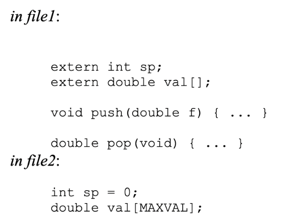
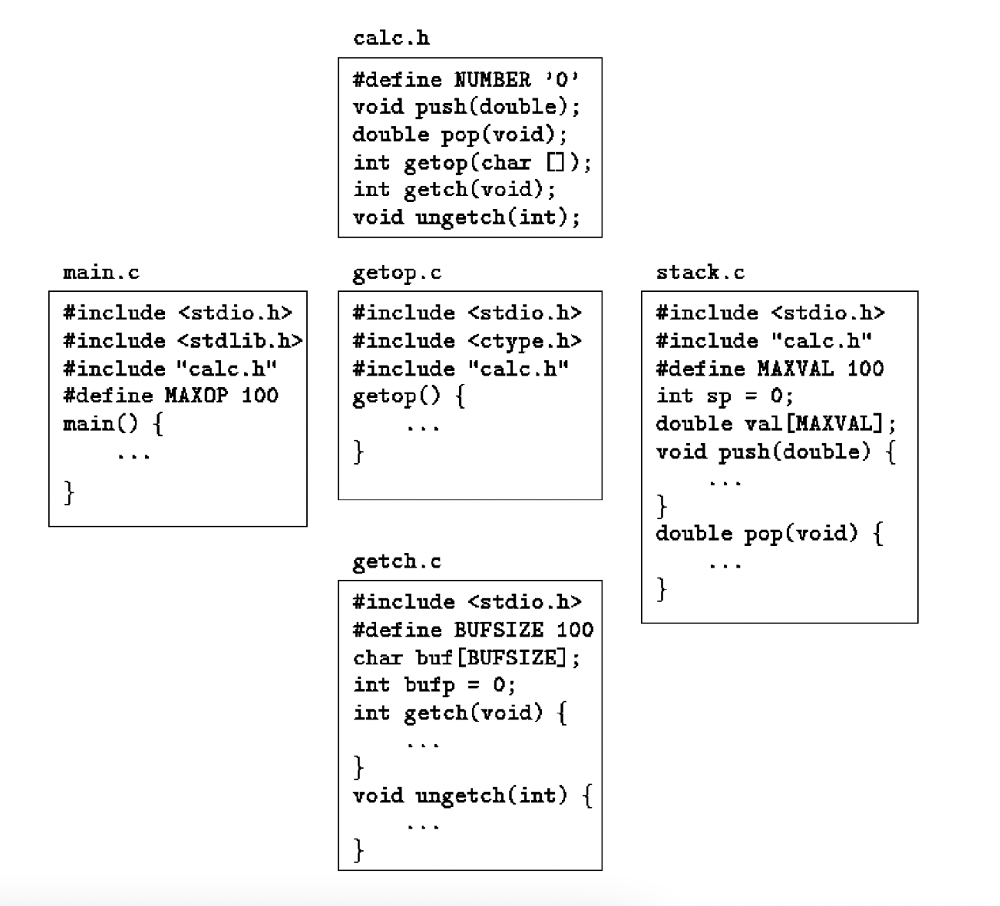

# lesson-6

### Compiling

Suppose that three functions are stored in three files called main.c, getline.c, and strindex.c. Then the command cc main.c getline.c strindex.c compiles the three files, placing the resulting object code in files main.o, getline.o and strindex.o, then loads them into an executable file called a.out. If there is an error, say in main.c, the file can be recompiled by itself and the result loaded with the previous object files, with the command cc main.c getline.o strindex.o (the cc command uses the .c versus .o naming convention to distinguish source files from object files).

#### Compiling scenarios mentioned in the book
```c
#include <stdio.h>
#define MAXLINE 100
/*rudimentary calculator */
main() {
	double sum, atof(char []);
	char line[MAXLINE];
	int getLine(char line[], int max);

	sum = 0;
	while (getline(line, MAXLINE) > 0)
		printf(“\t%g\n”, sum += atof(line));
	return 0;
}
```
The declaration 
```double sum, atof(char []); ```
Says that sum is a double variable, and that atof is a function that takes one char[] argument and returns a double.

The function atof() must be declared and defined consistently. If atof itself and the call to it in main have inconsistent types in the same source file, the error will be detected by the compiler. But if (as is more likely) atof were compiled separately, the mismatch would not be detected, atof would return a double that main would treat as an int, and meaningless answers would result. —> the reason a mismatch can happen is that if there is no function prototype, a function is implicitly declared by its first appearance in an expression, such as: 
```sum += atof(line)```

If a function declaration does not include arguments, as in 
```double atof();```
That is taken to mean that nothing is to be assumed about the arguments of atof; all parameter checking is off. This is bad syntax, if the function takes arguments, declare them; if it takes no arguments, use void.
double atof(void);
```c
/* atoi: convert string s to integer using atof */
int atoi(char s[])
{
	double atof(char s[]);
	return (int) atof(s);
}
```
This operation does potentially discard information, however, so some compilers warn of it. The cast states explicitly that the operation is intended, and suppresses any warning.

###  Make Files - ATOF
#### ATOF - In One File
```c
#include <stdio.h>
#include <ctype.h>

// K&R Pg. 71
// atof: convert string s to double

double atof(char s[])
{
    double val, power;
    int i, sign;

    for (i=0; isspace(s[i]); i++) // skip white space
        ;

    sign = (s[i] == '-') ? -1 : 1;
    if (s[i] == '+' || s[i] == '-')
        i++;

    for (val=0.0; isdigit(s[i]); i++)
        val = 10.0 * val + (s[i] - '0');

    if (s[i] == '.')
        i++;

    for (power=1.0; isdigit(s[i]); i++)
    {
        val = 10.0 * val + (s[i] - '0');
        power *= 10.0;
    }
    return sign * val / power;
}

int main()
{
    char input[] = "-1.23";
    printf("%f\n", atof(input));

    return 0;
}
```

### ATOF - In 2 Files - ATOF.C AND ATOF.H

#### atof.h
```c
#include <stdio.h>

double atof(char s[]);
```

#### atof.c
```c
#include <ctype.h>

// K&R Pg. 71
// atof: convert string s to double

double atof(char s[])
{
    double val, power;
    int i, sign;

    for (i=0; isspace(s[i]); i++) // skip white space
        ;

    sign = (s[i] == '-') ? -1 : 1;
    if (s[i] == '+' || s[i] == '-')
        i++;

    for (val=0.0; isdigit(s[i]); i++)
        val = 10.0 * val + (s[i] - '0');

    if (s[i] == '.')
        i++;

    for (power=1.0; isdigit(s[i]); i++)
    {
        val = 10.0 * val + (s[i] - '0');
        power *= 10.0;
    }
    return sign * val / power;
}
```
#### main.c
```c
#include <stdio.h>
#include <atof.h>

int main()
{
    char input[] = "-1.23";
    printf("%f\n", atof(input));

    return 0;
}
```

### ATOF - In 2 files, compiling
```gcc -o main atof.c main.c -I.```


### SIMPLE MAKEFILE
#### makefile
```make
# this will compile all files every time make is run
make: main.c atof.c atof.h
    gcc -o main main.c atof.c -I.

# this will clean or remove compiled files so you can start fresh
clean:
    rm -f *.o *.exe
make
make clean
```


### UPDATED MAKE FILE
```make
This allows you to only recompile
# Definitions for constants
CC=gcc
CFLAGS=-I.

# This will create your final output using .o compiled files
make: main.o atof.o
    $(CC) $(CFLAGS) -o main main.o atof.o

# This will compile atof.c
atof.o: atof.c atof.h
    $(CC) $(CFLAGS) -c atof.c

# This will compile main.c with its dependency
main.o: main.c atof.h
    $(CC) $(CFLAGS) -c main.c

# This will clean or remove compiled files so you can start fresh
clean:
    rm -f *.o *.exe
```

## Reverse Polish Calculator - each operator follows its operands. 
(1 + 2) * (4 + 5) is entered as 1 2 - 4 5  + * in polish notation.


### Implementation:
- Each operand is pushed onto a stack
- When an operator arrives, the proper number of operands (two for binary operators) is popped
- The operator is applied to them
- And the result is pushed back onto the stack.
- When the end of the input line is encountered, the value on the top of the stack is popped and printed.


### Pseudocode: 

### Questions to consider before writing code: 
What functions should we have?
- void push(double f) { …}
- double pop(void) { … }
- int getop(char s[]) { …}
- main()


What variables should be external?
- stack
- Stack position


What functions should have access to what variables?
- Only push and pop have access to stack 


## MAKE FILES - REVERSE POLISH CALCULATOR
#### CALCULATOR - ALL IN 1 FILE
```c
#include <stdio.h>
#include <stdlib.h> // for atof()

// K&R page 76-79

#define MAXOP   100 // max size of operand or operator
#define NUMBER  '0' // signal that a number was found

int getop(char []);
void push(double);
double pop(void);

// reverse Polish calculator
int main()
{
    int type;
    double op2;
    char s[MAXOP];

    while ((type = getop(s)) != EOF) 
    {
        switch (type) {
        case NUMBER:
            push(atof(s));
            break;
        case '+':
            push(pop() + pop());
            break;
        case '*':
            push(pop() * pop());
            break;
/* note that for - and / the left and right operand must be distinguished. If we did push(pop() - pop()); the order in which the two calls of pop are evaluated is not defined. To guarantee the right order, it is necessary to pop the first value into a temporary variable as we did in main.
*/
        case '-':
            op2 = pop(); 
            push(pop() - op2);
            break;
        case '/':
            op2 = pop();
            if (op2 != 0.0)
                push(pop() / op2);
            else
                printf("error:zero divisor\n");
            break;
        case '\n':
            printf("\t%.8g\n", pop());
            break;
        default:
            printf("error: unknown command %s\n", s);
            break;
        }
    }
    return 0;
}

#define MAXVAL 100  // maximum depth of val stack

int sp = 0;         // next free stack position
double val[MAXVAL]; // value stack

// push: push f onto value stack
void push(double f)
{
    if (sp < MAXVAL)
        val[sp++] = f;
    else
        printf("error:stack full, can't push %g\n", f);
}

// pop:pop and return top value from stack
double pop(void)
{
    if (sp > 0)
        return val[--sp];
    else {
        printf("error:stack empty\n");
        return 0.0;
    }
}

int getch(void);
void ungetch(int);

// getop: get next operator or numeric operand
int getop(char s[])
{
    int i, c;

    while ((s[0] = c = getch()) == ' ' || c == '\t')
        ;

    s[1] = '\0';
    if (!isdigit(c) && c != '.')
        return c; // not a number
    i = 0;
    if (isdigit(c)) // collect integer part
        while (isdigit(s[++i] = c = getch()))
            ;
    if (c == '.') // collect fraction part
        while (isdigit(s[++i] = c = getch()))
            ;

    s[i] = '\0';
    if (c != EOF)
        ungetch(c);
    return NUMBER;
}

/* It’s often the case that a program cannot determine that it has read enough input until it has read too much. One instance is collecting characters that make up a number: until the first non-digit is seen, the number is not complete. But then the program has read one character too far, a character that it is not prepared for. 

ungetch solves this problem by making it possible to “un-read” the unwanted character. Then every time the program reads one character too many, it could push it back on the input, so the rest of the code could behave as if it had never been read.

*/

#define BUFSIZE 100

char buf[BUFSIZE];  // buffer for ungetch
int bufp = 0;       // next free position in buf

int getch(void) // get a (possibly pushed back) charater
{
    return (bufp > 0) ? buf[--bufp] : getchar();
}

void ungetch(int c) // push character back on input
{
    if (bufp >= BUFSIZE)
        printf("ungetch:too many characters\n");
    else
        buf[bufp++] = c;
}
```

## Scope Rules
The scope of a name is the part of the program within which the name can be used. For an automatic variable declared at the beginning of a function, the scope is the function in which the name is declared. This is true of the parameters of the function, which are in effect local variables. 

The scope of an external variable or a function lasts from the point at which it is declared to the end of the file being compiled. In the scope they can be used by just naming them. These external variables can be used outside of this scope if they are declared with the term “extern”.

In C language definition and declaration for a variable takes place at the same time. i.e. there is no difference between declaration and definition.
If the lines 
```c
int sp;
double val[MAXVAL];
```
appear outside of any function, they define the external variables sp and val, cause storage to be set aside and also serve as the declarations for the rest of that source file. On the other hand, the lines
```c
extern int sp;
extern double val[];
```
Declare for the rest of the source file that sp is an int and that val is a double array (whose size is determined elsewhere), but they do not create the variables or reserve storage for them. 

Array sizes must be specified with the definition, but are optional with an extern declaration. The initialization of an external variable goes only with the definition (you should nor declare and initialize a value with extern). So in the case that you defined the variables in a separate file1, then in file 2 it would look like:



https://www.geeksforgeeks.org/difference-between-definition-and-declaration/ 

Declaration of a function provides the compiler with the name of the function, the number and type of arguments it takes, and its return type. For example, consider the following code,

```c
int add(int, int);
```
Here, a function named add is declared with 2 arguments of type int and return type int. Memory will not be allocated at this stage. Definition of the function is used for allocating memory for the function. For example, consider the following function definition,
```c
int add(int a, int b)
  {
    return (a+b);
  }
```
During this function definition, the memory for the function add will be allocated.


Use extern variables carefully - using too much can lead to programs where data connections are not all obvious - variables can be changs in unexpected and even inadvertent ways, and the program is hard to modify. 

## Header files - 
The definitions and declarations shared among the files. As much as possible, we want to centralize this, so that there is only one copy to get and keep right as the program evolves. Accordingly, we will place this common material in a header file, calc.h, which will be included as necessary.

For this small program, it is fine that we have one headgear file that contains everything. For a much larger program, more organization and more headers would be needed.



## Static Variables - 
The static declaration, **applied to an external variable or function**, limits the scope of that object to the rest of the source file being compiled. External static thus provides a way to hide names like buf and bufp in the getch-ungetch combination, which must be external so they can be shared, yet which should not be visible to users of getch and ungetch.

- Static storage is specified by prefixing the normal declaration with the word static.
```c
static char buf[BUFSIZE];
static int bufp = 0;

int getch(void) { … }
void ungetch(int c) { … }
```
- If the two routines and the two variables are compiled in one file as above, then no other routine will be able to access buf and bufp, and those names will not conflict with the same names in other files of the same program. In the same way, the variables that push and pop use for stack manipulation can be hidden, by declaring sp and val to be static.

Normally function names are global, visible to any part of the entire program. If a **function is declared static**, however, its name is invisible outside of the file in which it is declared. 

**Internal static variables** are local to a particular function just as automatic variables are, but unlike automatics, they remain in existence rather than coming and going each time the function is activated. This means that internal static variables provide private, permanent storage within a single function. 

## Register Variables - 
A register declaration advises the compiler that the variable in question will be heavily used. The idea is that the register variables are to be placed in machine registers, which may result in smaller and faster programs. But compilers are free to ignore the advice. 
```c
register int x;
register char c;
```

The register declaration can only be applied to automatic variables and to the formal parameters of a function. In this later case, it looks like
```c
f(register unsigned m, register long n)
{
	register int i;
	…
}
```

Depending on the hardware, there are restrictions on how many variables can be in the register, and what types are allowed. Excess definitions are harmless, bc the extra will be ignored. It is not possible to take the address of a register variable.

Block Structure - 
An automatic variable declared and initialized in a block is initialized each time the block is entered.

If an automatic variable has the same name as an external variable or function, the automatic variable hides any outer occurrences. 
```c
int x;
int y;
f(double x) {
	double y;
}
```
Inside f, x is the double, outside f, x refers to the external x, … 

## Initialization - 
External and static variables
- If not explicitly initialized, it’s guaranteed to be initialized to 0.
- The initializer must be a constant expression. The initialization is done before the program begins execution.
Automatic and register variables 
- If not explicitly initialized, have undefined (garbage) initial values.
- Initializer is not restricted to being constant, it may be an expression involving other variables/function calls.


Scalar variables 
- variables with one value, as opposed to an array
- may be initialized when they are defined, by following the name with an equal sign and expression.


Arrays
- may be initialized by following its declaration with a list of initializers enclosed in braces and separated by commas. 
```c
int days[] = {31, 28, 31, 30, 31, 31, 30, 31, 30, 31 }
```
- When the size of the array is omitted, the compiler will compute the length by counting the initializers, of which there are 12 in this case.
- If there are fewer initializers for an array than the specified size, the others will be zero for external, static and automatic variables. It is an error to have too many initializers or initialize some elements of an array but not others.
- Character arrays are a special case of initialization; a string may be used instead of the braces and commas notation. The following two lines are the same:
```c
		char pattern = “ould”;
		char pattern[] = {‘o’, ‘u’, ‘l’, ‘d’, ‘\0’};
	// In this case the array size is 5 (4 characters plus the ‘\0’).
```
	
## Recursion
Functions can call themselves, either directly or indirectly.
When a function calls itself recursively, each invocation gets a fresh set of all the automatic variables, independent of the previous set. 

// QuickSort function showing recursion - given an array, one element is chosen and the others partitioned in two subsets - those less than the partition element and those greater than or equal to it. The same process is then applied recursively to the two subsets. When a subset has fewer than two elements, it doesn’t need any sorting; this stops the recursion.

One algo:
1. Move partition element to the first position
2. Find first element that is greater than partition element and swap with first element less than partition element
3. Continue step 2 until index of first element greater is more than the index of first element less than 
4. Swap partition element back into its position
5. Call quicksort on left and right sub arrays


Diff algo:
```c
// Online C compiler to run C program online
#include <stdio.h>

void qsort(int v[], int left, int right)
{
    int last;
    void swap(int v[], int i, int j);
    printf("Left Value: %d Right Value: %d\n", left, right);
    if (left >= right) //do nothing if array contains fewer than two elements
        return;
    
    swap(v, left, (left + right)/2); // move partition elem to v[0]
    last = left; // represents the last value less than partition
    
    for (int curr=left + 1; curr <= right; curr ++){
        printf("%d %d\t %d %d\n", curr, left, v[curr], v[left]);
        if (v[curr] < v[left]){
            ++last; 
            printf("%d %d last:%d\n", curr, left, last);
            // if current value is less than the partition value and current value is not last value, swap the two so 
            // that the last value is the current value
            if (curr != last)
                swap(v, last, curr);
        }
    }
    printf("Reset ");
    swap(v, left, last); // swap partition element with last value less than it
    qsort(v, left, last-1);
    qsort(v, last+1, right);
}

void swap(int v[], int i, int j)
{  
    int temp;
    temp = v[i];
    v[i] = v[j];
    v[j] = temp;
    
    printf("swap: %d %d %d %d %d %d\n", v[0], v[1], v[2], v[3], v[4], v[5]);
}
void printArray(int arrayLength, int v[]){
    // the arrayLength must be passed in, bc v is a pointer to the array
    // doing sizeof (v) will give us the size of the pointer
    if (arrayLength == 0) {
        printf("too small\n");
        return;  
    }
        
    for(int i = 0; i < arrayLength; i++)
      printf("%d ", v[i]);
    
    printf("\n");
}

void main (){
    int v[] = {12, 3, 10, 4, 34, 19};
    int arrayLength = (sizeof (v) /sizeof (v[0]));
    int start = 0;
    int end = 5;
    
    printf("Starting Array: ");
    printArray(arrayLength, v);
    
    qsort(v, start, end); 
    
    printf("Sorted Array: ");
    printArray(arrayLength, v);
}
```


## The C Preprocessor 
Preprocessor - first step in compilation that does replacing

**File Inclusion** replaces ```#include “filename”/<filename>``` with the contents of the file filename. So, if an included file is changed, all files that depend on it must be recompiled.
	
**Macro Substitution** with ```#define name replacement``` replaces any later occurrences of **name** with **replacement** till the end of the file.
- Definitions can be continued onto several lines by placing a \ at the end of each line to be continued.
- A definition may use previous definitions.
- You can define a name with an infinite loop:
```#define forever for(;;)```
- You can define macros with arguments:
```#define max(A,B) ((A) > (B) ? (A) : (B))``` This macro, unlike a function, will serve for any data type, so you can even do: x = max(p, r)
```c
#include <stdio.h>
#define max(A,B) ((A) > (B) ? (A) : (B))


 main() {
    int x = max(2, 4);
    printf("%d", x);

    char y = max('z', 'd');
    printf("\n%c", y);
}
```

- Macros do have side effects, such as if max is called with ++a, then a is incremented twice, ```#define square(x) x*x``` must be specified as ```#define square(x) (x)*(x)`` or else ```square(a + b)``` will evaluate wrong.
- Macros are still useful to avoid the run-time overhead of calling a function each time. Getchar and putchar are often defined as macros to avoid calling a function for each character processed. 
- Names can be undefined with #undef
	- Ensures that a routine is really a function not a macro:
```c
#undef getchar
int getchar(void) { … }
```
- To make a macro argument a quoted string, use # before the argument. A debug statement can be written as 
```#define dprint(expr) printf(#expr “ =%g\n”, expr)```
→ When it is invoked with dprint(x, y)
→ The macro is expanded into printf(“x/y” “ =&g\n”, x/y), and the two strings are concating printing out a legal string constant.
- \## concatenates two arguments:
- ```#define paste(front, back) front ## back``` 
- ```paste(name, 1)``` makes the token name1

**Conditional Inclusion** to control preprocessing with conditional statements to include code selectively
- defined(name) in a #if is 1 if the name has been defined, and 0 otherwise. 
	- So if we want to make sure that the contents of a header are included only once, the contents of the file are surrounded with a conditional like this.
```
#if !defined(HDR)
#define HDR
/* contents of hdr.h go here */
#endif
```
	- defined(name) and !defined(name) can also be written as #ifdef and #ifndef
	- The first inclusion of hdr.h defines the name HDR; later inclusions will find the name defined and skip down to the #endif. This is useful for each header itself to include any other headers on which it depends, without the user having to deal with interdependence. 
- This sequence tests the name SYSTEM to decide which version of a header to include:
```c
	#if SYSTEM == SYSV
		#define HDR “sysv.h”
	#elif SYSTEM == BSD
		#define HDT “bsd.h”
	#else
		#define HDR “default.h”
	#endif
	#include HDR
```

# CALCULATOR IN MULTIPLE FILES - MAIN.C
```c
#include <stdio.h>
#include <stdlib.h>
#include <calc.h>

// K&R page 76-79

#define MAXOP   100 // max size of operand or operator

// reverse Polish calculator
int main()
{
    int type;
    double op2;
    char s[MAXOP];

    while ((type = getop(s)) != EOF) 
    {
        switch (type) {
        case NUMBER:
            push(atof(s));
            break;
        case '+':
            push(pop() + pop());
            break;
        case '*':
            push(pop() * pop());
            break;
        case '-':
            op2 = pop();
            push(pop() - op2);
            break;
        case '/':
            op2 = pop();
            if (op2 != 0.0)
                push(pop() / op2);
            else
                printf("error:zero divisor\n");
            break;
        case '\n':
            printf("\t%.8g\n", pop());
            break;
        default:
            printf("error: unknown command %s\n", s);
            break;
        }
    }
    return 0;
}
```

CALCULATOR IN MULTIPLE FILES - CALC.H
```c
#define NUMBER  '0' // signal that a number was found

void push(double);
double pop(void);
int getop(char []);
int getch(void);
void ungetch(int);
```

CALCULATOR IN MULTIPLE FILES - STACK.C
```c
#include <stdio.h>
#include <calc.h>

#define MAXVAL 100  // maximum depth of val stack

int sp = 0;         // next free stack position
double val[MAXVAL]; // value stack

// push: push f onto value stack
void push(double f)
{
    if (sp < MAXVAL)
        val[sp++] = f;
    else
        printf("error:stack full, can't push %g\n", f);
}

// pop:pop and return top value from stack
double pop(void)
{
    if (sp > 0)
        return val[--sp];
    else {
        printf("error:stack empty\n");
        return 0.0;
    }
}
```

CALCULATOR IN MULTIPLE FILES - GETOP.C
```c
#include <stdio.h>
#include <ctype.h>
#include <calc.h>

// getop: get next operator or numeric operand

int getop(char s[])
{
    int i, c;

    while ((s[0] = c = getch()) == ' ' || c == '\t')
        ;

    s[1] = '\0';
    if (!isdigit(c) && c != '.')
        return c; // not a number
    i = 0;
    if (isdigit(c)) // collect integer part
        while (isdigit(s[++i] = c = getch()))
            ;
    if (c == '.') // collect fraction part
        while (isdigit(s[++i] = c = getch()))
            ;

    s[i] = '\0';
    if (c != EOF)
        ungetch(c);
    return NUMBER;
}

```

CALCULATOR IN MULTIPLE FILES - GETCH.C
```c
#include <stdio.h>
#include <ctype.h>
#include <calc.h>

// getop: get next operator or numeric operand

int getop(char s[])
{
    int i, c;

    while ((s[0] = c = getch()) == ' ' || c == '\t')
        ;

    s[1] = '\0';
    if (!isdigit(c) && c != '.')
        return c; // not a number
    i = 0;
    if (isdigit(c)) // collect integer part
        while (isdigit(s[++i] = c = getch()))
            ;
    if (c == '.') // collect fraction part
        while (isdigit(s[++i] = c = getch()))
            ;

    s[i] = '\0';
    if (c != EOF)
        ungetch(c);
    return NUMBER;
}
```

CALCULATOR - COMPILING
```
    gcc -o main.exe main.c getch.c getop.c stack.c -I.
```


CALCULATOR - MAKE FILE
```make
# Definitions for constants
CC=gcc
CFLAGS=-I.

# This will create your final output using .o compiled files
make: main.o stack.o getch.o getop.o
    $(CC) $(CFLAGS) -o main main.o stack.o getch.o getop.o

stack.o: stack.c
    $(CC) $(CFLAGS) -c stack.c

getch.o: getch.c
    $(CC) $(CFLAGS) -c getch.c

getop.o: getop.c
    $(CC) $(CFLAGS) -c getop.c

# This will compile main.c with its dependency
main.o: main.c calc.h
    $(CC) $(CFLAGS) -c main.c

# This will clean or remove compiled files so you can start fresh
clean:
    rm -f *.o *.exe
```

# Homework:
- The C Programming Language, 2nd Edition - Kernighan & Ritchie, Chapter 1.10, 4.3-4.11
- HW link - check lesson 5
